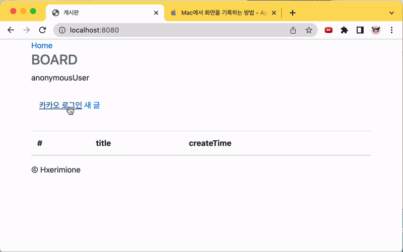
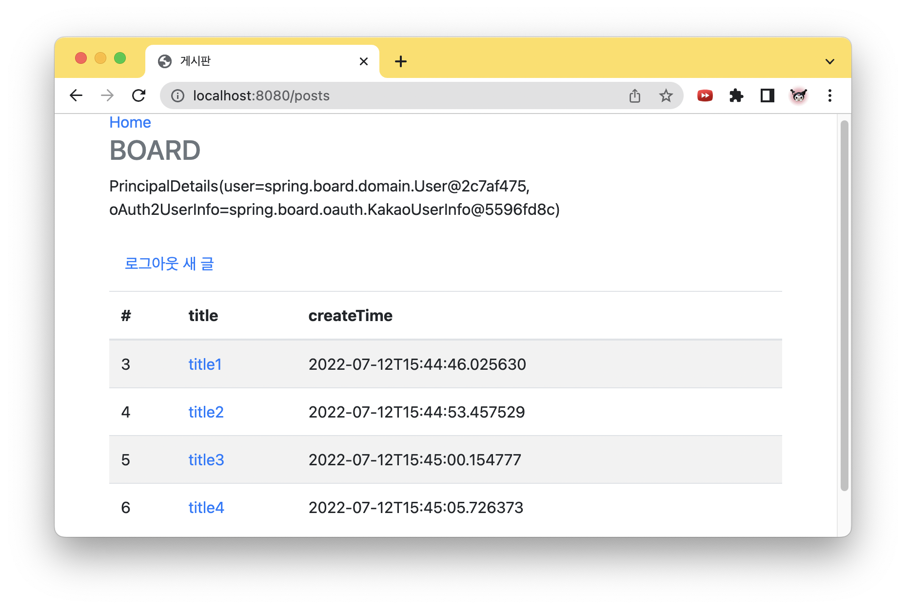
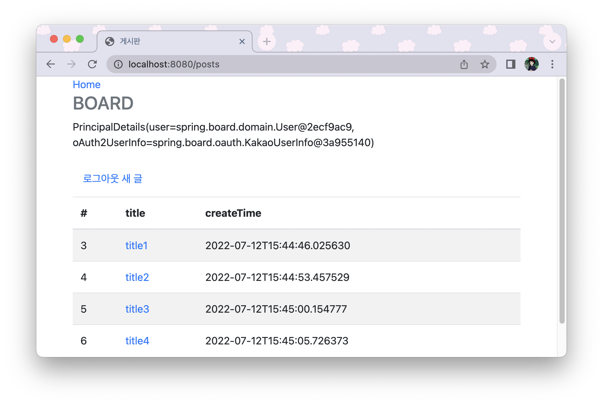
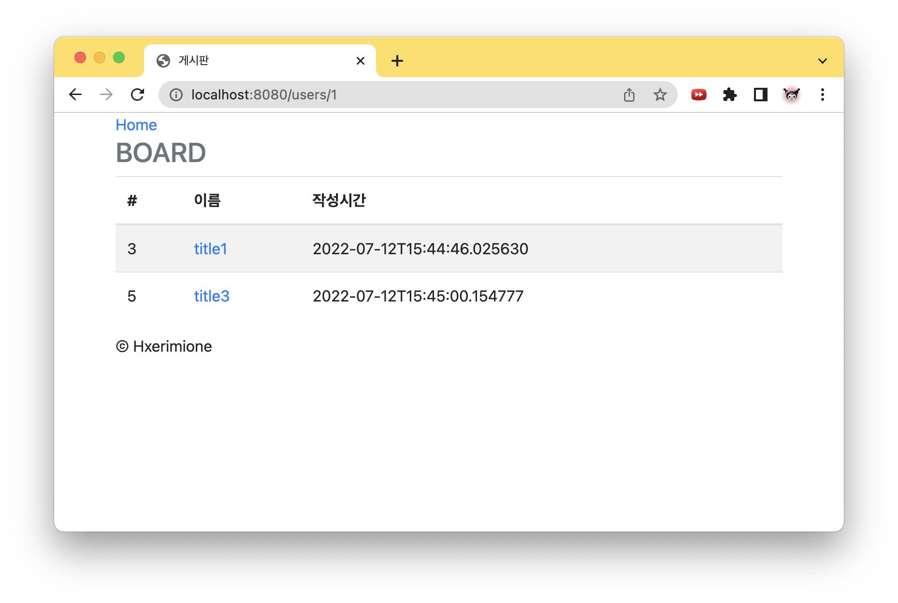
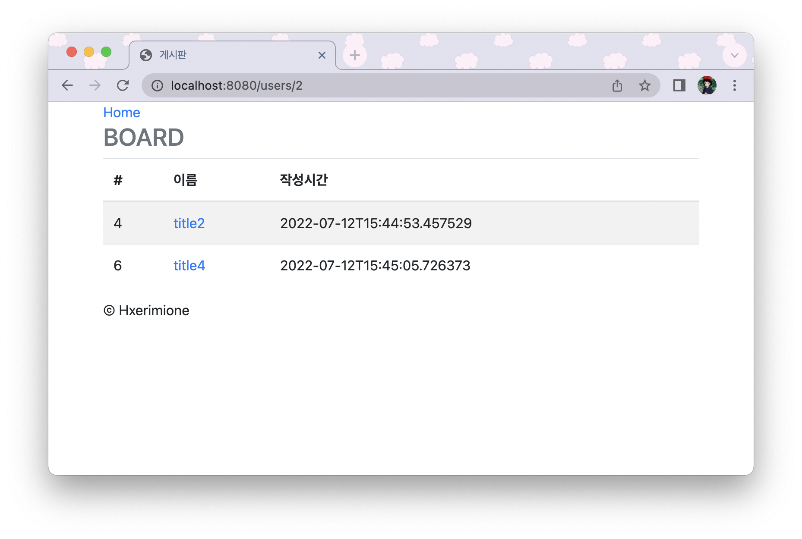

### 게시판 기능설명

##### 로그인
- OAuth2.0을 이용한 카카오 로그인을 사용하였다.
##### 게시글 작성
- 게시글을 추가할 수 있다. 
- 제목, 내용, 작성자, 작성 시간 등의 정보가 DB에 저장된다.
##### 게시글 수정
- 글의 제목과 내용을 작성자만 수정할 수 있다.
- 글을 수정하면 수정시간도 update된다.
##### 삭제
- 게시글 삭제 시 해당 게시글의 작성자만 삭제할 수 있다.
- 유저 삭제 시 해당 유저의 게시글까지 모두 삭제된다.
##### 회원 구분
- 둘 이상의 회원이 게시글을 작성하였을 때, 회원별로 작성한 글을 확인할 수 있다.

